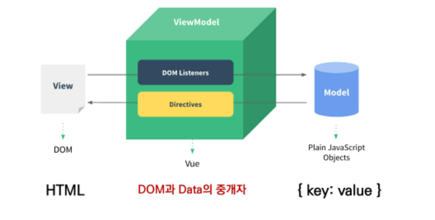
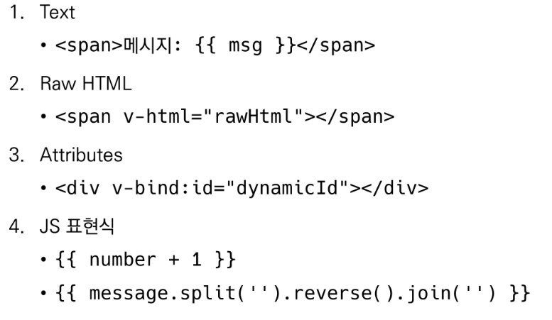

## Vue.js 정리 

#### 프론트엔드 프레임워크

- HTML, CSS, JS 활용해서 데이터를 볼 수 있게 만들어줌
- 이 작업 통해 사용자(User)는 데이터와 상호작용(Interaction) 할 수 있음

#### Vue.js

- 사용자 인터페이스 만들기 위한 진보적인 자바스크립트 프레임워크
- 현대적인 툴과 다양한 라이브러리를 통해 SPA 완벽 지원
  - SPA (Single Page Application) 단일 페이지 애플리케이션
    - 현재 페이지를 동적으로 렌더링함으로써 사용자와 소통하는 웹 애플리케이션
    - 서버로부터 최초에만 페이지 다운로드 -> 이후에는 동적으로 DOM 구성
    - 동작 원리 일부가 CSR 따른다

#### CSR (Client Side Rendering)

- 클라이언트에서 화면을 구성
- 처음엔 뼈대만 받고 브라우저에서 동적으로 DOM 그림 
- 장점과 단점
  - 장점 
    - 1. 서버와 클라이언트 간 트래픽 감소
      2. 사용자 경험(UX) 향상
  - 단점
    - 1. SSR에 비해 전체 페이지 최종 렌더링 시점이 시점이 느림
      2. SEO(검색엔진 최적화)에 어려움 있음

#### SSR (Server Side Rendering)

- 서버에서 클라이언트에게 보여줄 페이지를 모두 구성하여 전달하는 방식
- JS 웹 프레임워크 이전에 사용
- 장점과 단점 
  - 장점
    - 1. 초기 구동 속도가 빠름 (클라이언트가 빠르게 컨텐츠 볼 수 있음)
      2. SEO에 적합
  - 단점
    - 모든 요청마다 새로운 페이지를 구성하여  전달
      - 반복되는 전체 새로고침으로 사용자 경험 떨어짐
      - 트래픽 많아서 서버 부담됨

- Vue.js에 DOM과  Data가 연결되어있어서 data 변경하면 이에 연결된 DOM은 알아서 변경! => 오직 Data 대한 관리만 신경쓰기

### MVVM Pattern

- 애플리케이션 로직을 UI로부터 분리하기 위해 설계된 디자인 패턴 
- 1. Model
  2. View
  3. View Model 

#### Vue.js 코드 작성 순서

- Data가 변화하면 DOM이 변경! 
- 1. Data 로직 작성
  2. DOM 작성

#### Element 속성 바인딩

- v-bind, v-if, v-for에 들어가는 꺼내오는 내용들은 모두 data 안에 들어있는 애들이다
- v-on : 행동 => methods 안에 실행할 메소드 입력해두기
- **v-model** ; 얘 아직 잘 모르겠다..

#### Vue instance 인스턴스

- 모든 vue 앱은 vue 함수로 새 인스턴스를 만드는 것부터 시작!
- vue 인스턴스 생성할 때 options 객체 전달해야한다..
  - 여러 옵션 사용해서 원하는 동작 구현!
- Options 
  - el : vue에 연결한 기존 DOM 요소
  - data : vue 인스턴스의 데이터 객체 ,, vue 인스턴스 상태 데이터 정의하는 곳
    - v-bind, v-on과 같은 directive에서도 사용 가능
    - vue 객체 내 다른 함수에서 this 키워드 통해 접근 가능
  - methods : vue 인스턴스에 추가할 메서드
    - v-on 과 같은 directive에서도 사용 가능
    - vue 내 다른 함수에서 this 통해 접근 가능
    - 화살표 함수 사용 불가! 
  - computed : 데이터가 변경될 때만 함수를 실행
    - 특정 데이터 직접적으로 사용/가공해서 다른 값 만들때 사용
    - 특정 값 변동하면 해당 값 다시 계산해서 보여준다!
    - 반드시 반환값 있어야한다! 
    - 함수 형태로 정의하지만 함수 X 반환값이 바인딩된다! 
    - 종속 대상을 따라 저장(캐싱)
  - methods : 렌더링 다시 할 때마다 항상 함수 실행
  - watch : 데이터를 감시, 데이터에 변화가 일어났을 때 실행되는 함수
    - 감시할 데이터 지정하고 그 데이터 바뀌면 특정 함수 실행하는 방식! 
  - filter : 텍스트 형식화를 적용할 수 있는 필터 
    - 자바스크립트 표현식 마지막에 `|` 와 함께 추가되어야한다! 
    - 이어서 사용가능

#### Template Syntax

- 렌더링 된 DOM을 기본 Vue 인스턴스 데이터에 선언적으로 바인딩 할 수 있는 HTML 기반 템플릿 구문을 사용 
  - 바인딩 ,,, 기본단위가 가질 수 있는 구성요소의 구체적인 값, 성격 확정하는 것

1. **Interpolation 보간법**

2. **Directive 디렉티브** 

- v- 접두사가 있는 특수 속성
- 속성값 : 단일 JS 표현식 (v-for은 예외!)
- 표현식의 값이 변경될 때 반응적으로 DOM에 적용하는 역할

#### directive

1. v-text : 엘리먼트의 textContent 업데이트

2. v-html :  innerHTML 업데이트, XSS 공격에 취약할 수 있음, 사용자로부터 입력 받은 내용 사용 금지!

3. v-show: 단순히 엘리먼트에 display CSS 속성 토글하는 것! 조건부 렌더링 중 하나

4. v-if, v-else-if, v-else: 조건에 따라 요소를 렌더링,  directive 표현식이 true 일때만 렌더링!

   엘리먼트 및 포함된 directive => 토글하는 동안 삭제되고 다시 작성됨 

5. **v-for** : 원본 데이터를 기반으로 엘리먼트 or 템플릿 블록을 여러번 렌더링! 
   반드시 key 속성을 각 요소에 작성!!!!!!!!!!!!!!!!!!!

6. **v-on**: 엘리먼트에 이벤트 리스너 연결. 특정 이벤트 발생하면 주어진 코드 실행됨! 

7. **v-bind** : HTML 요소의 속성에 vue의 상태 데이터를 값으로 할당.. 
   object 형태로 사용하면 value가 true인 key가 class 바인딩 값으로 할당! 

8. **v-model**: HTML form 요소의 값과 data 양방향 바인딩!!!!!!!! 
   form에 입력된 값을 data로 바인딩 시켜준다... 

---

#### Component 컴포넌트 

- 기본 HTML 엘리먼트 확장하여 재사용 가능한 코드를 캡슐화 하는데 도움을 줌
- 유지보수 쉽고 재사용성 측면에서도 매우 강력한 기능 제공
- `Vue 컴포넌트 === Vue 인스턴스`

#### SFC (Single File Component)

